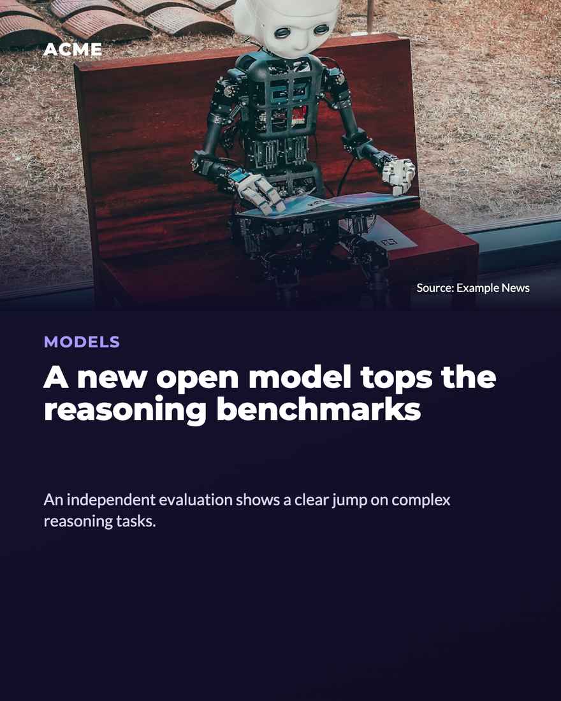

# Social Post Agent

An AI agent that drafts your brand's weekly social posts (LinkedIn / Instagram)
inside **Google Chat**, with a human always in the loop. Each week it proposes a
post idea, prepares the content, renders a ready-to-share image, posts it in chat as
a **draft**, and writes the captions — then stops and waits for a person to approve.
It never publishes anything on its own.

This repo is the reusable *engine*. Clone it, plug in your own Google Cloud project,
Google Chat app and brand templates, and run it. The example brand throughout is a
fictional **"Acme"** — replace it with yours.

> Secrets and per-deployment values live **only** in Script Properties, never in
> code. Nothing brand-specific or secret is hardcoded.

<p align="center">
  
  <br><sub><em>A post rendered by the built-in renderer, using the neutral <strong>“Acme”</strong> example template. Swap in your own background and fonts.</em></sub>
</p>

## What it does

- **Proactive**: a weekly trigger (Monday morning by default) posts a fresh post idea
  into a chat space.
- **Reactive**: the team chats with the agent in natural language ("make the second
  title punchier", "give me other news", "ok, generate it") and it responds.
- **Human approval required**: the agent prepares the draft (image + captions) and
  stops. Only after an explicit "Approved" does it confirm the post is ready.

Three example post types ship in the box: **News** (a 5-slide carousel), **Event /
Webinar**, and **Hiring**. Add or change types by editing the tools + templates.

## Architecture

```
   Weekly scheduler ─┐
                     ▼
 ┌──────────────┐   doPost    ┌───────────────────────────┐   HTTP    ┌──────────────────┐
 │  Google Chat │ ──────────► │  Apps Script agent        │ ────────► │  Cloud Run        │
 │  (a space)   │ ◄────────── │  (Gemini via Vertex AI)   │  /render  │  renderer         │
 └──────────────┘  post reply │                           │ ◄──────── │  (Puppeteer,      │
        ▲                     │  tools:                   │    PNG    │   HTML → PNG)     │
        │                     │   • search_news           │           └──────────────────┘
        │  draft card (image) │   • generate_post_news    │
        └─────────────────────│   • generate_post_event   │
           via service account│   • generate_post_hiring  │
                              └───────────────────────────┘
```

- **Google Chat** is just the I/O surface: people talk to the agent, the agent posts
  back.
- **Apps Script** hosts the agent loop, the Chat app (webhook + async worker) and the
  weekly scheduler. It calls **Gemini** (`gemini-2.5-flash`) through **Vertex AI**,
  authenticated with the script's own OAuth token (no API key).
- **Cloud Run renderer** turns post data into PNG images (headless Chromium). The
  agent builds a URL for each slide; Chat downloads the image directly from it.

The model sits behind a thin interface — the loop is vendor-neutral in spirit and the
prompt/tools are plain data, so swapping the model is a configuration change, not a
rewrite.

### Request → draft flow

1. A person writes in the chat space (or the weekly trigger fires).
2. `doPost` posts an immediate ack, enqueues the message, and returns. A recurring
   worker (`processQueue_`, every minute) drains the queue — this keeps the webhook
   fast and side-steps the limits on runtime-created triggers.
3. The worker runs the **agent loop**: it sends the system prompt + history to Gemini
   with the tool declarations. Gemini either replies with text or calls tools.
4. When Gemini calls `generate_post_*`, the agent asks the renderer for the image URL
   and posts a **draft card** into the space via the service account.
5. Gemini then writes the LinkedIn + Instagram captions and asks the team to approve.
6. Nothing is published automatically — that final step is manual (by design).

An "act, don't announce" guard in the loop forces a tool call if the model merely says
it *will* search/generate (or when the user gives a short assent like "ok, go"), so it
does the thing instead of just talking about it.

## The tools

| Tool | What it does |
|------|--------------|
| `search_news` | Finds the freshest news for a query. Tries the Google Custom Search API (if configured), else falls back to public RSS feeds. Resolves article images (og:image / twitter:image / JSON-LD). Returns real titles, sources, links and images only. |
| `generate_post_news` | Renders + posts the News carousel (cover + exactly 5 slides) as a draft. |
| `generate_post_event` | Renders + posts an Event / Webinar post (1–2 speakers, optional photos). |
| `generate_post_hiring` | Renders + posts a Hiring post (1–2 open roles). |

Two rules baked into the prompt and tool descriptions are the valuable part and are
kept intact: **use only real news from `search_news` (never invent news)** and **never
invent an image URL** (copy the real one from the search result, or leave it empty).

## How the renderer works

The renderer (`renderer/server.js`) is a small Express + Puppeteer service:

- `GET|POST /render?type=news|cover|event|hiring&...` → a single PNG.
- `GET /carousel?c=<base64url JSON>` → a composite preview grid (cover + 5 news).
- `GET /carousel.zip?c=<base64url JSON>` → a ZIP of all full-resolution slides.

Each template is an HTML string with absolutely-positioned widgets. Text fields marked
`.fit` auto-shrink to fit their box (`data-maxh`). Remote images are fetched with a
browser User-Agent and a magic-byte type sniff (`fetchImageDataUri`) so hotlink-protected
CDNs and mislabeled content-types still work, then inlined as data URIs.

The bundled templates are **neutral, CSS-only** (gradients + text) so the service runs
out of the box with **no external background image**. See
[Bring your own brand templates](#bring-your-own-brand-templates) to make them yours.

## Setup

Prerequisites: a Google Cloud project (billing enabled), a Google Workspace account
with Google Chat, [`clasp`](https://github.com/google/clasp) and Node 18+ / `gcloud`
installed.

The short version (full step-by-step in [`docs/SETUP.md`](docs/SETUP.md)):

1. **Deploy the renderer to Cloud Run.**
   ```bash
   cd renderer
   gcloud run deploy social-post-renderer --source . --region <your-region> \
     --allow-unauthenticated --memory 1Gi
   ```
   Note the service URL it prints.

2. **Create the Apps Script project and push the agent.**
   ```bash
   cd agent
   cp .clasp.json.example .clasp.json   # put your real scriptId in it
   clasp push
   ```
   Add the [OAuth2 for Apps Script](https://github.com/googleworkspace/apps-script-oauth2)
   library (id `1B7FSrk5Zi6L1rSxxTDgDEUsPzlukDsi4KGuTMorsTQHhGBzBkMun4iDF`) — it's
   already declared in `appsscript.json`.

3. **Set Script Properties** (Project Settings → Script Properties) — see the table below.

4. **Create the Google Chat app** pointing its webhook at the Apps Script web-app
   deployment; create a service account with the *Chat Bot* role and paste its JSON key
   into `CHAT_SA_CREDENTIALS`.

5. **Run setup once**: from the Apps Script editor, run `setupChatApp` — it registers
   the queue worker (every minute) and the weekly proposal trigger (Monday 08:00).

### Configuration (Script Properties)

| Key | Required | Description |
|-----|----------|-------------|
| `GCP_PROJECT_ID` | yes | Your Google Cloud project id (e.g. `your-gcp-project`). |
| `GCP_LOCATION` | yes | Vertex AI region (e.g. `europe-west1`, `us-central1`). |
| `RENDERER_URL` | yes | Base URL of your deployed Cloud Run renderer. |
| `CHAT_SA_CREDENTIALS` | yes | Service-account JSON key (as one string) with the Chat Bot role. |
| `CHAT_SPACE` | yes | Chat space for the weekly proposal (e.g. `spaces/AAAAAAAAAAA`). |
| `SYSTEM_PROMPT` | no | Overrides the built-in prompt at runtime. If unset, uses `SYSTEM_PROMPT_TEXT_`. |
| `GOOGLE_SEARCH_API_KEY` | no | Google Custom Search API key. If set with `GOOGLE_SEARCH_CX`, news search uses it; otherwise it falls back to RSS. |
| `GOOGLE_SEARCH_CX` | no | Custom Search engine id (cx). |

See [`agent/config.example.gs`](agent/config.example.gs) for a helper that seeds these.
**Never commit real values.**

## Bring your own brand templates

The example templates draw everything in CSS. Real brand posts usually start from a
background PNG exported from a design tool, with text/widgets positioned over it. The
pattern (documented inline in `renderer/server.js`):

1. Export a clean background PNG at the template's exact pixel size (e.g. 1080×1350).
2. Drop it in `renderer/assets/` and load it as a data URI (see the commented `BG`
   block in `server.js`).
3. In the template's `widgets(f)` function, position each widget with absolute
   coordinates over the background.
4. Tune the coordinates by hitting `GET /render?type=...` and nudging px values.
5. Give long text fields the class `fit` + a `data-maxh` so they auto-shrink.

To add a whole new post type: add a `TOOL_DECLARATIONS` entry (`agent/tool-declarations.gs`),
a handler + image-URL builder (`agent/renderer.gs`), a `dispatchToolCall_` case
(`agent/agent-loop.gs`), and a template in `renderer/server.js`.

## Repo layout

```
agent/                 Apps Script project (flat folder — clasp rootDir)
  agent-loop.gs        LLM loop + tool dispatch
  tool-declarations.gs Function declarations sent to Gemini
  tool-handlers.gs     search_news (Custom Search + RSS + og:image resolver)
  renderer.gs          Renderer client + generate_post_* handlers + diagnostics
  chat-app.gs          Google Chat webhook, async queue worker, weekly scheduler, setup
  chat-store.gs        Per-thread history, job queue, posting via service account
  system-prompt-text.gs Embedded example system prompt (Acme)
  config.gs            getConfig()
  config.example.gs    Documents Script Properties + a seeding helper
  appsscript.json      Manifest (scopes, OAuth2 lib, Chat advanced service)
  test-tools.gs        Manual tests + diagnostics (run from the editor)
  test-chat.gs         Chat/store tests
  .clasp.json.example  Copy to .clasp.json and add your scriptId
renderer/              Cloud Run renderer (Express + Puppeteer)
  server.js            HTML → PNG engine, templates, routes
  Dockerfile           Based on the official Puppeteer image
  assets/              Bundled fonts (Montserrat, Lato — SIL OFL, see NOTICE)
docs/SETUP.md          Full step-by-step deploy guide
```

## License

MIT — see [`LICENSE`](LICENSE). Bundled fonts are under the SIL Open Font License —
see [`NOTICE`](NOTICE).
